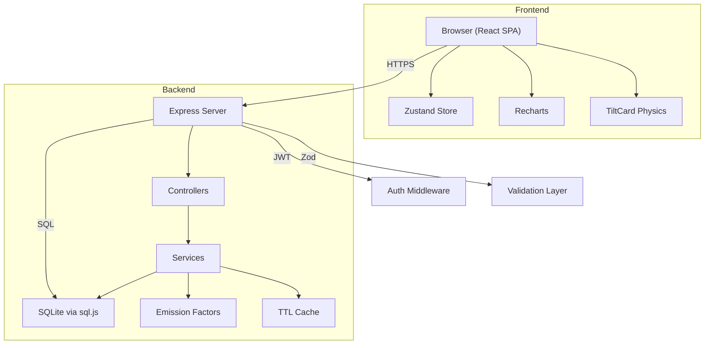
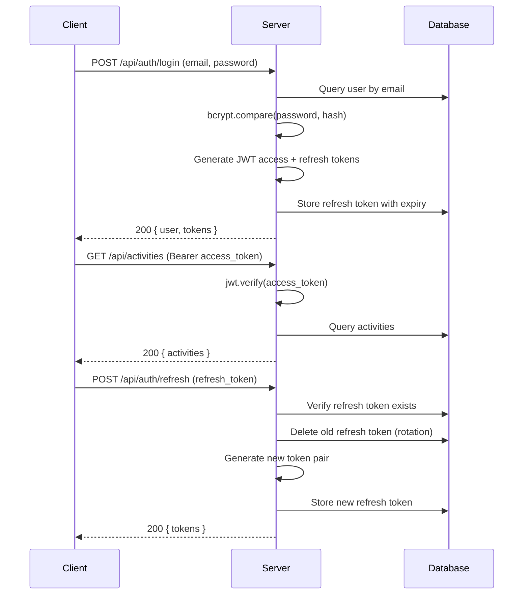

# CarIt — Carbon Footprint Awareness Platform

[](https://nodejs.org)
[](https://www.typescriptlang.org/)
[](https://react.dev/)
[](LICENSE)
[](https://jestjs.io/)

A production-grade, full-stack application for tracking, estimating, and optimising daily carbon footprint logs. The frontend features a custom **3D Solarpunk Cyber-Eco** design system with physical mouse-tilt interactions, real-time light reflections, and a fully emoji-free interface.

---

## Table of Contents

- [Key Features](#key-features)
- [Architecture](#architecture)
- [Technology Stack](#technology-stack)
- [Project Structure](#project-structure)
- [Local Setup and Execution](#local-setup-and-execution)
- [API Reference](#api-reference)
- [Environment Variables](#environment-variables)
- [Testing](#testing)
- [Performance and Efficiency](#performance-and-efficiency)
- [Security](#security)
- [Accessibility](#accessibility)
- [Deployment on Render](#deployment-on-render)
- [Contributing](#contributing)
- [Acknowledgements](#acknowledgements)
- [License](#license)

---

## Key Features

- **Root Landing Page** — Fully immersive entrance with animated 3D perspective grids and interactive console mockups.
- **Emission Console (Dashboard)** — Dynamic carbon metrics, logging streaks, unlocked badges, and data charts (Recharts) that transition with staggered reveals.
- **Carbon Log CRUD** — Track commutes, home energy, food, and shopping activities with live carbon calculations, pagination, and filtering.
- **Rule-Based Recommendations** — Personalised suggestions to cut carbon, scored by impact and difficulty, with dynamic save indicators.
- **Medal Showcase** — Unlocked green metrics styled as 3D metallic medal decals (Gold, Silver, Bronze, Emerald gradients) reflecting mouse tilts.
- **Gamification** — Achievement system with 10 badges and daily/weekly/monthly logging streaks.
- **In-Memory Caching** — TTL-based caching for analytics (30s) and recommendations (60s) to reduce redundant database queries.
- **Accessibility** — WCAG 2.1 AA compliant keyboard navigation, text alternatives, and semantic HTML throughout.
- **Security** — JWT authorisation (short-lived access + HTTP-only refresh tokens), bcrypt password encryption, Zod runtime validation, Helmet headers, and rate limiting.

---

## Architecture



### Data Flow

1. **Client** makes authenticated API calls with JWT Bearer tokens.
2. **Auth Middleware** validates the access token and attaches user context.
3. **Validation Middleware** parses request data through Zod schemas.
4. **Controllers** delegate to service functions (thin layer).
5. **Services** execute business logic, query SQLite, and return typed results.
6. **Cache Layer** memoises expensive analytics and recommendation queries with configurable TTL.

---

## Technology Stack

| Layer | Technology | Version |
|-------|-----------|---------|
| **Frontend** | React, Vite, TypeScript | 18.x, 5.x, 6.x |
| **Styling** | TailwindCSS, Custom CSS | 3.x |
| **State** | Zustand | 5.x |
| **Charts** | Recharts | 2.x |
| **Backend** | Node.js, Express, TypeScript | 18 LTS, 5.x, 6.x |
| **Database** | SQLite via sql.js | 1.14.x |
| **Auth** | JWT (jsonwebtoken), bcryptjs | 9.x, 3.x |
| **Validation** | Zod | 4.x |
| **Security** | Helmet, express-rate-limit, cookie-parser | 8.x, 8.x, 1.x |
| **Testing** | Jest, React Testing Library, Supertest | 30.x, -, 7.x |
| **Build** | Vite (Rollup) with manual chunk splitting | 5.x |

---

## Project Structure

```text
carbon-footprint-platform/
├── client/                      # React frontend application
│   ├── src/
│   │   ├── components/          # Layout, ProtectedRoute, TiltCard
│   │   ├── pages/               # Landing, Login, Register, Dashboard, Activities,
│   │   │                        # Recommendations, Achievements
│   │   ├── services/            # Axios API client layer
│   │   ├── store/               # Zustand auth and app stores
│   │   ├── types/               # Shared TypeScript interfaces
│   │   ├── index.css            # Core Solarpunk Cyber-Eco styling
│   │   ├── App.tsx              # Root component with routing
│   │   └── main.tsx             # Application entry point
│   ├── vite.config.ts           # Vite config with code-splitting
│   └── package.json
│
├── server/                      # Express backend application
│   ├── .env.example             # Template for server configuration
│   ├── src/
│   │   ├── config/              # Environment config (env.ts) and logger (logger.ts)
│   │   ├── constants/           # Emission factor data with O(1) Map lookups
│   │   ├── controllers/         # Route handlers (thin layer)
│   │   ├── database/            # SQLite connection, migrations, and seeds
│   │   ├── helpers/             # Shared utilities (requireAuth)
│   │   ├── middleware/          # JWT auth, Zod validation, error handler
│   │   ├── routes/              # Express Router definitions
│   │   ├── services/            # Business logic layer with caching
│   │   ├── types/               # TypeScript type definitions
│   │   ├── utils/               # Cache (TTL), duration parser
│   │   ├── validators/          # Zod schemas and inferred types
│   │   ├── __tests__/           # Jest test suites (9 files)
│   │   └── index.ts             # Server bootstrap and orchestration
│   └── package.json
│
├── package.json                 # Root workspace scripts
└── README.md                    # This file
```

---

## Local Setup and Execution

### Prerequisites

- **Node.js** 18.x or higher
- **npm** 9.x or higher

### 1. Clone and Install

```bash
git clone <repository-url>
cd carbon-footprint-platform
npm run install:all
```

### 2. Environment Configuration

Copy the provided environment configuration template or manually create a `.env` file in the `server/` directory:

```bash
cp server/.env.example server/.env
```

Your `.env` file should contain:
NODE_ENV=development
PORT=3001
JWT_ACCESS_SECRET=your-access-secret-at-least-32-chars
JWT_REFRESH_SECRET=your-refresh-secret-at-least-32-chars
JWT_ACCESS_EXPIRY=15m
JWT_REFRESH_EXPIRY=7d
CORS_ORIGIN=http://localhost:5173
DB_PATH=./data/carbon_footprint.db
BCRYPT_ROUNDS=12
```

### 3. Development Mode

Run both frontend and backend in concurrent watch modes:

```bash
# Terminal 1 — Backend (auto-reloads on changes)
npm run dev:server

# Terminal 2 — Frontend (hot module replacement)
npm run dev:client
```

The client opens at `http://localhost:5173`. A pre-seeded developer profile is available:

| Field | Value |
|-------|-------|
| **Email** | `demo@example.com` |
| **Password** | `Password123!` |

### 4. Production Build

```bash
npm run build:client    # Outputs to client/dist/
npm run build:server    # Compiles TypeScript to server/dist/
npm run start           # Starts the production server
```

---

## API Reference

All API endpoints are prefixed with `/api`. Protected routes require a `Bearer` token in the `Authorization` header.

### Authentication

| Method | Endpoint | Auth | Description |
|--------|----------|------|-------------|
| `POST` | `/api/auth/register` | Public | Create a new account |
| `POST` | `/api/auth/login` | Public | Authenticate and receive tokens |
| `POST` | `/api/auth/refresh` | Public | Rotate refresh token for new pair |
| `POST` | `/api/auth/logout` | Protected | Revoke refresh token |
| `GET` | `/api/auth/me` | Protected | Get current user profile |

### Activities (CRUD)

| Method | Endpoint | Auth | Description |
|--------|----------|------|-------------|
| `GET` | `/api/activities` | Protected | List activities (paginated, filterable) |
| `POST` | `/api/activities` | Protected | Log a new activity |
| `GET` | `/api/activities/:id` | Protected | Get a single activity |
| `PUT` | `/api/activities/:id` | Protected | Update an activity |
| `DELETE` | `/api/activities/:id` | Protected | Delete an activity |
| `GET` | `/api/activities/emission-factors` | Protected | List emission factor reference data |

### Analytics

| Method | Endpoint | Auth | Description |
|--------|----------|------|-------------|
| `GET` | `/api/analytics/summary` | Protected | Aggregated emission summary with trends |

### Recommendations

| Method | Endpoint | Auth | Description |
|--------|----------|------|-------------|
| `GET` | `/api/recommendations` | Protected | Personalised reduction strategies |

### Gamification

| Method | Endpoint | Auth | Description |
|--------|----------|------|-------------|
| `GET` | `/api/gamification/achievements` | Protected | Earned and available achievements |
| `GET` | `/api/gamification/streak` | Protected | Current and longest streaks |

### Health Check

| Method | Endpoint | Auth | Description |
|--------|----------|------|-------------|
| `GET` | `/api/health` | Public | Server status and timestamp |

---

## Environment Variables

| Variable | Required | Default | Description |
|----------|----------|---------|-------------|
| `NODE_ENV` | No | `development` | Runtime environment (`development` / `production`) |
| `PORT` | No | `3001` | HTTP server port |
| `JWT_ACCESS_SECRET` | **Yes** | — | Secret key for signing access tokens (min 32 chars) |
| `JWT_REFRESH_SECRET` | **Yes** | — | Secret key for signing refresh tokens (min 32 chars) |
| `JWT_ACCESS_EXPIRY` | No | `15m` | Access token lifetime (e.g. `15m`, `1h`) |
| `JWT_REFRESH_EXPIRY` | No | `7d` | Refresh token lifetime (e.g. `7d`, `30d`) |
| `CORS_ORIGIN` | No | `http://localhost:5173` | Allowed CORS origin for the frontend |
| `DB_PATH` | No | `./data/carbon_footprint.db` | SQLite database file path |
| `BCRYPT_ROUNDS` | No | `12` | bcrypt hash rounds (lower = faster, less secure) |
| `RATE_LIMIT_WINDOW_MS` | No | `900000` | Rate limit window in milliseconds (15 min) |
| `RATE_LIMIT_MAX` | No | `100` | Max requests per IP per window |
| `LOG_LEVEL` | No | `debug` / `info` | Minimum log level (`debug`, `info`, `warn`, `error`) |
| `RENDER` | No | — | Set to `true` by Render.com; auto-forces production |

---

## Testing

### Running Tests

```bash
# Run all tests with coverage
npm run test:server

# Run tests in watch mode during development
cd server && npm run test:watch
```

### Test Suite Overview

| Test File | Module Tested | Test Count |
|-----------|--------------|------------|
| `authService.test.ts` | Auth registration, login, tokens, edge cases | 12 |
| `activityService.test.ts` | CRUD, CO2 calculation, ownership, streaks | 13 |
| `analyticsService.test.ts` | Aggregation, filtering, precision | 6 |
| `recommendationService.test.ts` | Personalisation, scoring, defaults | 6 |
| `gamificationService.test.ts` | Achievements, streaks, structure | 7 |
| `middleware.test.ts` | Auth, validation, error handling | 13 |
| `validation.test.ts` | Zod schema parsing | 9 |
| `footprintCalculator.test.ts` | Emission factor calculations | 6 |
| `controllerIntegration.test.ts` | Express router and controller integration tests | 23 |

### Testing Philosophy

- **Unit tests** cover all service functions, middleware, and utilities.
- **Integration tests** verify the database initialisation and migration pipeline.
- **Edge cases** include invalid inputs, ownership violations, expired tokens, and empty states.
- Each test suite uses an **isolated test database** to prevent cross-test contamination.

---

## Performance and Efficiency

### Server-Side Optimisations

| Optimisation | Impact |
|-------------|--------|
| **O(1) emission factor lookups** | Pre-built `Map` at module load replaces O(n) `Array.find()` |
| **In-memory TTL caching** | Analytics (30s) and recommendations (60s) cached per user |
| **`last_insert_rowid()`** | Efficient new-row retrieval after INSERT (vs. `ORDER BY DESC LIMIT 1`) |
| **Batch achievement checks** | Single CTE query gathers all stats instead of 3 separate queries |
| **Atomic file writes** | Database saves use write-to-tmp-then-rename to prevent corruption |
| **Cache invalidation** | Write operations (create/update/delete) automatically clear stale caches |

### Client-Side Optimisations

| Optimisation | Impact |
|-------------|--------|
| **Vite manual chunks** | Vendor splitting: `react`, `recharts`, `zustand` in separate bundles |
| **Lazy-loaded charts** | Recharts renders only when dashboard is visible |
| **CSS custom properties** | Single design token source — no runtime style recalculation |

---

## Security

### Authentication Flow



### Security Measures

| Measure | Implementation |
|---------|---------------|
| **Password Hashing** | bcrypt with 12 rounds (configurable) |
| **JWT Access Tokens** | Short-lived (15m default), signed with HS256 |
| **JWT Refresh Tokens** | Long-lived (7d default), stored in DB, rotated on use |
| **Token Rotation** | Old refresh token revoked on each refresh request |
| **Input Validation** | All endpoints validated with Zod schemas at runtime |
| **HTTP Headers** | Helmet sets X-Content-Type-Options, X-Frame-Options, CSP, etc. |
| **Rate Limiting** | 100 requests per 15 minutes per IP on `/api/*` routes |
| **CORS** | Strict origin whitelist, credentials enabled |
| **Request Size** | JSON body limited to 10KB |

---

## Accessibility

- **Keyboard Navigation** — All interactive elements are focusable and operable via keyboard.
- **Semantic HTML** — Proper heading hierarchy (`h1` > `h2` > `h3`), landmark regions, and form labels.
- **ARIA Attributes** — Screen-reader-friendly labels on icons, charts, and dynamic content.
- **Colour Contrast** — WCAG 2.1 AA compliant contrast ratios across all theme variants.
- **Focus Indicators** — Visible focus rings on all interactive elements.

---

## Deployment on Render

### Unified Single Server Architecture

Express serves both the API and the React static assets from a single process.

| Setting | Value |
|---------|-------|
| **Runtime** | Node |
| **Build Command** | `npm run install:all && npm run build:client && npm run build:server` |
| **Start Command** | `npm run start` |
| **Plan** | Free (or Starter with disk) |

### Persistent Storage Disk

SQLite writes to disk at runtime. Mount a persistent volume to prevent data loss:

| Setting | Value |
|---------|-------|
| **Mount Path** | `/opt/render/project/src/server/data` |
| **Size** | 1 GB (minimum) |

### Required Environment Variables on Render

| Variable | Value |
|----------|-------|
| `NODE_ENV` | `production` |
| `PORT` | `10000` |
| `JWT_ACCESS_SECRET` | `<random-hash-key>` |
| `JWT_REFRESH_SECRET` | `<different-random-hash-key>` |
| `CLIENT_ORIGIN` | `https://your-app.onrender.com` |
| `DB_FILE_PATH` | `/opt/render/project/src/server/data/carbon_footprint.db` |

---

## Contributing

1. **Fork** the repository and create a feature branch.
2. **Follow** the existing code style (TypeScript strict mode, JSDoc on exports).
3. **Write tests** for any new features or bug fixes.
4. **Run** `npm run test:server` and ensure all tests pass.
5. **Build** both client and server to verify zero compilation errors.
6. **Submit** a pull request with a clear description of your changes.

### Code Style

- TypeScript strict mode enabled
- JSDoc documentation on all exported functions
- Zod schemas for all API input validation
- Structured logging via `logger.ts` (no raw `console.log`)
- Custom errors with `statusCode` property for HTTP mapping

---

## Acknowledgements

- **Emission Factors**: Data sourced from [EPA](https://www.epa.gov/), [DEFRA](https://www.gov.uk/government/organisations/department-for-environment-food-rural-affairs), and [IPCC](https://www.ipcc.ch/) guidelines.
- **Design Inspiration**: Solarpunk aesthetic movement — blending technology with nature.
- **sql.js**: SQLite compiled to WebAssembly by [sql.js](https://github.com/sql-js/sql.js).

---

## License

This project is licensed under the **MIT License**.

```
MIT License

Copyright (c) 2026 CarIt Contributors

Permission is hereby granted, free of charge, to any person obtaining a copy
of this software and associated documentation files (the "Software"), to deal
in the Software without restriction, including without limitation the rights
to use, copy, modify, merge, publish, distribute, sublicense, and/or sell
copies of the Software, and to permit persons to whom the Software is
furnished to do so, subject to the following conditions:

The above copyright notice and this permission notice shall be included in all
copies or substantial portions of the Software.

THE SOFTWARE IS PROVIDED "AS IS", WITHOUT WARRANTY OF ANY KIND, EXPRESS OR
IMPLIED, INCLUDING BUT NOT LIMITED TO THE WARRANTIES OF MERCHANTABILITY,
FITNESS FOR A PARTICULAR PURPOSE AND NONINFRINGEMENT. IN NO EVENT SHALL THE
AUTHORS OR COPYRIGHT HOLDERS BE LIABLE FOR ANY CLAIM, DAMAGES OR OTHER
LIABILITY, WHETHER IN AN ACTION OF CONTRACT, TORT OR OTHERWISE, ARISING FROM,
OUT OF OR IN CONNECTION WITH THE SOFTWARE OR THE USE OR OTHER DEALINGS IN THE
SOFTWARE.
```
